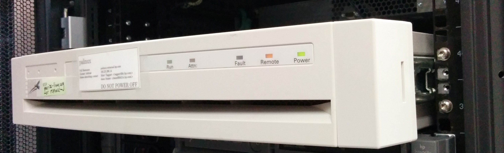
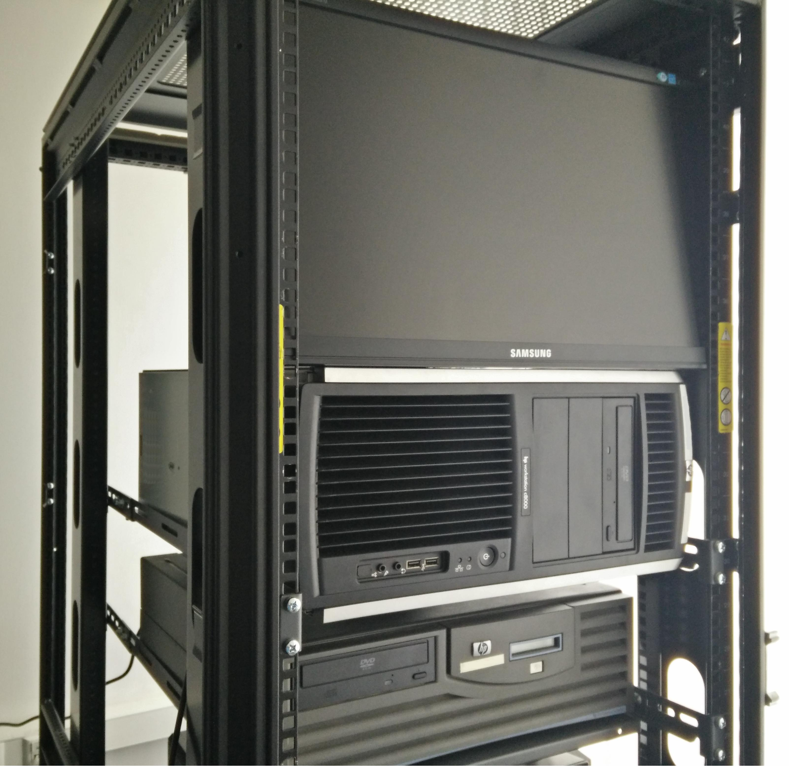

=============================
PA-RISC Linux Project History
=============================

OLD NEWS
========

Dec 2020
~~~~~~~~
- Reached `12.000 pre-built debian packages <http://buildd.debian.org/status/architecture.php?a=hppa&suite=sid>`__.

Oct 2020
~~~~~~~~
- In Kernel 5.10 O_NONBLOCK was changed to become 000200000 (instead of
  000200004). This is a binary ABI change and requires userspace (glibc,
  dietlibc, systemd) to be recompiled with the new value. The kernel has
  wrapper functions which provide backwards compatibility.

Aug 2020
~~~~~~~~
- `Roger Sayle <mailto:roger@nextmovesoftware.com>`__ fixed a
  long-standing `gcc compiler bug which unnecessarily slowed down
  compile time <https://gcc.gnu.org/bugzilla/show_bug.cgi?id=87256>`__.

Jul 2020
~~~~~~~~
- Helge steps up as new `rbootd <https://git.kernel.org/pub/scm/linux/kernel/git/deller/rbootd.git/>`__
  maintainer.
- Dave fixes a `long-lasting kernel CPU soft lockup bug
  <https://git.kernel.org/pub/scm/linux/kernel/git/torvalds/linux.git/commit/?id=be6577af0cef934ccb036445314072e8cb9217b9>`__.
- Many bugfixes `1 <https://git.qemu.org/?p=qemu.git;a=commit;h=79826f99feb7222b7804058f0b4ace9ee0546361>`__\
  `2 <https://git.qemu.org/?p=qemu.git;a=commit;h=b1af755c33bf0d690553a5ccd93689dfd15a98e8>`__
  and improvements for qemu and preparations for qemu-5.1.0 release.  - 

Feb 2020
~~~~~~~~
- The graphics and device patches for PA-RISC have been applied to QEMU git.

Sep 2019
~~~~~~~~
- `PALO v2.12 released
  <http://git.kernel.org/pub/scm/linux/kernel/git/deller/palo.git/>`__.
  Added `kexec support <http://git.kernel.org/pub/scm/linux/kernel/git/torvalds/linux.git/commit/?id=fc697dc0c26a5908d467454e49440862d7fe96d0>`__
  and `enhanced ftrace support <http://git.kernel.org/pub/scm/linux/kernel/git/torvalds/linux.git/commit/?id=52a22e6c27be9089fdd9c4e1857939f0dec8f57c>`__
  to Linux kernel v5.4. LASI support (serial, parallel, network, PS/2
  keyboard & PS/2 mouse) and Artist graphics w/STI emulation for QEMU
  and SeaBIOS.

Jul 2019
~~~~~~~~
- `Released PALO version v2.11
  <http://git.kernel.org/pub/scm/linux/kernel/git/deller/palo.git/>`__
  with important enhancements by `James Bottomley
  <mailto:James.Bottomley@HansenPartnership.com>`__ like added
  ext4-support, IPL overlap with newer ext2/ext3 resize_inode was fixed
  and the iplboot bootcode loader is now placed inside the disk label.

May 2019
~~~~~~~~
- Linux kernel 5.2 supports `SPARSEMEM instead of DISCONTIGMEM
  <http://git.kernel.org/pub/scm/linux/kernel/git/torvalds/linux.git/commit/?id=dbdf0760990583649bfaca75fd98f76afd5f3905>`__,
  `static branches <http://git.kernel.org/pub/scm/linux/kernel/git/torvalds/linux.git/commit/?id=62217beb394e654bbd2bb87c533dadd2d8bf62c6>`__
  and `per-pagetable spinlocks <http://git.kernel.org/pub/scm/linux/kernel/git/torvalds/linux.git/commit/?id=b37d1c1898b288c69f3dc9267bc2c41af06f4a4b>`__.

Apr 2019
~~~~~~~~
- `Sven <mailto:svens@stackframe.org>`__ adds `KGDB
  <http://parisc.wiki.kernel.org/index.php/KGDB>`__ and `KPROBES
  <http://lwn.net/Articles/132196/>`__ support for the Linux kernel
  version 5.2.

Mar 2019
~~~~~~~~
- Lots of fixes and improvements in the QEMU CPU- and SCSI emulation
  code as well as for the SeaBIOS firmware due to efforts of `Sven
  Schnelle <mailto:svens@stackframe.org>`__. See the `PA-RISC Qemu Wiki
  page <http://parisc.wiki.kernel.org/index.php/Qemu>`__ for latest
  updates.

Jan 2019
~~~~~~~~
- Debian kernel 4.20 will ship built as SMP kernel only (for 32- and
  64-bit), which then patches itself at bootup to run faster on
  uniprocessor machines if it detects only one CPU.
- The OSUOSL team was so nice to upgrade the debian buildd servers:
  "parisc" has now two 300 GB (instead of two 68 GB) and panama three
  300 GB (instead of two 18 GB) SCSI discs. Thanks!

Nov 2018
~~~~~~~~
- A new complete `parisc-linux mailing list archive is now available at
  lore.kernel.org <http://lore.kernel.org/linux-parisc/>`__. It even
  contains the `very first parisc-linux mail
  <http://lore.kernel.org/linux-parisc/Pine.LNX.4.04.9901291134480.1532-100000@sprite.osfi-bsif.gc.ca/>`__.
- Linux kernel 4.20 includes the `"alternative"-feature which enables us
  to do live-patching of the kernel code at bootup time
  <http://git.kernel.org/pub/scm/linux/kernel/git/torvalds/linux.git/commit/?id=3847dab77421867fbc77faacb2f377d44e729e1b>`__.
  With this feature we will be able to build a SMP kernel which is
  patched at boottime to run faster on a UP system.

Sep 2018
~~~~~~~~
- Reached `11.700 pre-built debian unstable packages <http://buildd.debian.org/status/architecture.php?a=hppa&suite=sid>`__.

Jul 2018
~~~~~~~~
- Dave fixed a `long-standing binutils bug which generated wrong debug
  unwind info <http://sourceware.org/ml/binutils/2018-07/msg00474.html>`__.
- `Debian porterbox panama.debian.net is now available <http://db.debian.org/machines.cgi?host=panama>`__.

Apr 2018
~~~~~~~~
- The Linux kernel `now powers off rp34x0 and C8000 machines at shutdown
  via built-in BMC controller <http://git.kernel.org/pub/scm/linux/kernel/git/torvalds/linux.git/commit/?id=c6185e285c5c7cfeab739bae7f206ced695f09c7>`__.

Mar 2018
~~~~~~~~
- New documentation on how to access the :doc:`Baseboard Management
  Controller (BMC) in rp34x0 and C8000 machines <bmc>`.

Feb 2018
~~~~~~~~
- `QEMU 2.12 supports parisc system-emulation (qemu-system-hppa)
  <Qemu>`__ thanks to `contributions by Richard Henderson and Helge
  Deller <https://git.qemu.org/?p=qemu.git;a=commit;h=b05631954d6dfe93340d516660397e2c1a2a5dd6>`__.

Jan 2018
~~~~~~~~
- New `palo bootloader v2.00 released
  <http://git.kernel.org/pub/scm/linux/kernel/git/deller/palo.git/>`__.
  The callee copies ABI of gcc (on 32-bit hppa) created lots of
  optimization issues and problems with OpenMP, so `Dave committed a
  patch to switch to the caller copy ABI
  <http://gcc.gnu.org/ml/gcc-patches/2018-01/msg01518.html>`__ instead.
- First Qemu-related `patches to Linux kernel to reduce power
  consumption on the host <http://git.kernel.org/pub/scm/linux/kernel/git/torvalds/linux.git/commit/?id=310d82784fb4d60c80569f5ca9f53a7f3bf1d477>`__
  have been submitted and the Qemu hardware emulation works fully stable
  with a booted Linux. Even an emulated 32-CPU PA-RISC SMP machine was
  running stable.

Dec 2017
~~~~~~~~
- Development on parisc hardware emulation via qemu is ongoing. Richard
  Henderson maintains the `hppa qemu git tree
  <https://github.com/rth7680/qemu/commits/tgt-hppa-softmmu>`__ while
  Helge Deller works on a `parisc IODC and PDC firmware emulation via a
  SeaBIOS fork <https://github.com/hdeller/seabios-hppa/commits/parisc_firmware>`__.
  The emulation already boots a Debian install CD, runs through whole
  kernel initialization code and even runs quite far into the init
  process.

Sep 2017
~~~~~~~~
- New Debian-9 installer image is now available at `official cdimage
  places <https://cdimage.debian.org/cdimage/ports/>`__. Many thanks to
  Adrian Glaubitz!
- Kernel 4.14 includes full support for Page Deallocation Table (PDT),
  the UBSAN checker and kernel self-decompressor.

Aug 2017
~~~~~~~~
- Kernel 4.13 includes initial Page Deallocation Table (PDT) support to
  avoid using broken memory by the Linux kernel.
- Dave submitted all outstanding patches for hppa to glibc v2.26.
  Linuxthread support was dropped and switched to the generic nptl
  support instead. Unwinding was fixed to support pthread cancellation.
- Thomas Bogendoerfer fixed the PCI memory bar assignment on Dino/Cujo
  machines and as such got ATI graphic cards to work on such machines.
- New `palo bootloader v1.99 released
  <https://git.kernel.org/pub/scm/linux/kernel/git/deller/palo.git/>`__
  which fixes problems when loading huge kernels, e.g. with kernel UBSAN
  support enabled.

June 2017
~~~~~~~~~
- `Mike Hosken announced a new set of Debian 9 installation medias
  <https://lists.debian.org/debian-hppa/2017/06/msg00006.html>`__ which
  are `available for download
  <http://prometheus.parisc-linux.org/debian-cd/>`__
- New `palo bootloader v1.98 released
  <https://git.kernel.org/pub/scm/linux/kernel/git/deller/palo.git/>`__
  which fixes serial console on rp3410 and rp3440 servers.
- There are now `more than 11.600 pre-built debian unstable packages
  <https://buildd.debian.org/status/architecture.php?a=hppa&suite=sid>`__
  available.

May 2017
~~~~~~~~
- `Roberto C. Sánchez <mailto:roberto@debian.org>`__ sponsored a `HP
  rp3410 server
  <http://www.openpa.net/systems/hp-9000_rp3410_rp3440.html>`__ with
  :doc:`one 800 MHz PA8900 CPU which we upgraded to 5 GB RAM and added a 146
  GB hard disc <rp3410>`. The server is now reachable as
  `panama.parisc-linux.org <https://monitor.jrtc27.com/>`__ and acts as
  a debian buildd machine. `Hosting is sponsored by OSU Open Source Lab
  <http://osuosl.org/>`__. Thanks to all people involved, especially to
  the great system administrators at OSUOSL (Samarendra Hedaoo and
  Justin Dugger).

Apr 2017
~~~~~~~~
- John Paul Adrian Glaubitz and James Clarke made the `debian-installer
  available in debian-ports repositories
  <https://lists.debian.org/debian-powerpc/2017/04/msg00023.html>`__

Feb 2017
~~~~~~~~
- Alan Modra and Dave Anglin `fix pie support on hppa
  <https://sourceware.org/git/gitweb.cgi?p=binutils-gdb.git;h=8a3cacb06d6ecfbe3ab0e0059bf6a4eb8b4b9dc6>`__
  and `add -z relro support to binutils <https://sourceware.org/bugzilla/show_bug.cgi?id=21000>`__

Jan 2017
~~~~~~~~
- `New Debian-9 installation CDs
  <https://lists.debian.org/debian-hppa/2017/01/msg00001.html>`__ by
  Mike Hosken. Reached `more than 11.500 pre-built debian unstable
  packages <https://buildd.debian.org/status/architecture.php?a=hppa&suite=sid>`__.

Dec 2016
~~~~~~~~
- Reached more than 11.400 pre-built debian unstable packages. John
  David Anglin and John Paul Adrian Glaubitz fix the `Firefox webbrowser
  <https://buildd.debian.org/status/package.php?p=firefox&suite=sid>`__
  with help of Michael Karcher. The debian buildd servers switched to a
  unified automated build setup by James Clarke. Status of the buildds
  can be seen at https://monitor.jrtc27.com/

Nov 2016
~~~~~~~~
- `Richard Henderson announced initial work on a user-only target of
  hppa to QEMU
  <https://marc.info/?l=glibc-alpha&m=147869603031638&w=2>`__. The
  website and domain http://pateam.org has expired and all content is
  now archived at http://pateam.parisc-linux.org/. Thanks to Thibaut
  Varene for his work on pateam.org.

Oct 2016
~~~~~~~~
- New `palo v1.96 bugfix release available
  <https://git.kernel.org/cgit/linux/kernel/git/deller/palo.git/>`__.

Sep 2016
~~~~~~~~
- Reached more than 11.300 pre-built debian unstable packages. Linux
  Kernel 4.7 now `includes a high-resolution timer
  <http://git.kernel.org/cgit/linux/kernel/git/torvalds/linux.git/commit/?id=54b668009076caddbede8fde513ca2c982590bfe>`__
  based on the cr16 clocksource. Debian perl transition finished. Debian
  Linux Kernel 4.7.5 available.

Aug 2016
~~~~~~~~
- Debian transitions to gcc-6 and boost1.61, Debian on hppa changes the
  default mpi implementation from mpich to openmpi

Jul 2016
~~~~~~~~
- Reached more than 11.200 pre-built debian unstable packages.

Jun 2016
~~~~~~~~
- Reached more than 11.100 pre-built debian unstable packages.

Apr 2016
~~~~~~~~
- Linux kernel 4.7 got improved kernel ftrace support, kernel regset
  support and a native high-resolution clock/timing support. Additional
  debian buildd make server added (savaria.parisc-linux.org).

Mar 2016
~~~~~~~~
- Solved a `bug in gcc-4.9 (and higher)
  <https://gcc.gnu.org/bugzilla/show_bug.cgi?id=70188>`__ which `crashes
  kernel 4.3+ in the SCSI/block layer
  <http://article.gmane.org/gmane.linux.ports.parisc/26425>`__.

Feb 2016
~~~~~~~~
- We now have more than 11.000 pre-built debian unstable packages. Many
  bugs in kernel and userspace were fixed.

Jan 2016
~~~~~~~~
- Reached more than 10.900 pre-built debian unstable packages.

Dec 2015
~~~~~~~~
- `Huge Page support for PA-RISC was added to the Linux Kernel
  <http://git.kernel.org/cgit/linux/kernel/git/torvalds/linux.git/commit/?id=736d2169338a50c8814efc186b5423aee43b0c68>`__.
- A long-standing `syscall restart bug was fixed
  <http://git.kernel.org/cgit/linux/kernel/git/torvalds/linux.git/commit/?id=71a71fb5374a23be36a91981b5614590b9e722c3>`__.

Oct 2015
~~~~~~~~
- Dave & Helge fixed some bugs in `gcc
  <https://gcc.gnu.org/bugzilla/show_bug.cgi?id=68079>`__ and `glibc
  <https://sourceware.org/bugzilla/show_bug.cgi?id=19170>`__ which e.g.
  fixed the build of Qt5/KDE packages. For the first time ever we now
  have more pre-built debian packages than alpha or ppc64 and reached
  more than 10.800 packages.

Sep 2015
~~~~~~~~
- We have an additional Debian buildd server (phantom.parisc-linux.org
  with 4 x 1 GHz PA8900 CPUs, 12 GB RAM, 120 GB SSD) online. Dave `fixed
  64bit CAS LWS so that we will get 64bit gcc atomic builtins
  <http://git.kernel.org/cgit/linux/kernel/git/torvalds/linux.git/commit/?id=1b59ddfcf1678de38a1f8ca9fb8ea5eebeff1843>`__.
  Helge `fixed boot problems because of early serial port irqs on C8000
  with PA8900 CPUs
  <http://git.kernel.org/cgit/linux/kernel/git/torvalds/linux.git/commit/?id=b1b4e435e4ef7de77f07bf2a42c8380b960c2d44>`__.

Aug 2015
~~~~~~~~
- One of our buildd servers (hpviz) died. Debian-ports archive is now
  integrated with Debian buildd service again.

Jul 2015
~~~~~~~~
- Reached more than 10.700 pre-built debian unstable packages.

Jun 2015
~~~~~~~~
- Reached more than 10.600 pre-built debian unstable packages.

Apr 2015
~~~~~~~~
- Reached more than 10.520 pre-built debian unstable packages which is
  just around 60 packages less than the leading debian-ports
  architectures alpha and ppc64.

Mar 2015
~~~~~~~~
- Installation numbers of hppa debian machines grow to 25 in the `Debian
  Popularity Contest <http://popcon.debian.org>`__.

Feb 2015
~~~~~~~~
- `DEBIAN 8.0 (jessie) Installer images
  <http://ftp.debian-ports.org/debian-cd/hppa/debian-8.0/>`__ and
  `Installation instructions <Debian_Ports_Installation>`__ now
  available.

Jan 2015
~~~~~~~~
- Compared to other architectures on debian-ports, the PA-RISC / HPPA
  architecture now has the most number of packages up-to-date:
  http://buildd.debian-ports.org/stats/graph2-week-big.png

Dec 2014
~~~~~~~~
- Full range of gcc atomic builtins committed into gcc-4.9 which helped
  us to build packages which were not posible before (in total we are
  now at 10.400 prebuilt debian packages).

Nov 2014
~~~~~~~~
- We now fully support systemd with debian packages glibc-2.19-13 and
  linux-image-3.16.0-4 (kernel 3.16.7).
- The `contents of the parisc-linux kernel mailinglist were imported
  into gmane.org archive <http://dir.gmane.org/gmane.linux.ports.parisc>`__

Oct 2014
~~~~~~~~
- Reached 10.300 pre-built debian unstable packages.
- `Upcoming patches to support systemd on hppa
  <https://patchwork.kernel.org/patch/5048751>`__

Sep 2014
~~~~~~~~
- Browsers will now automatically be transferred to this Wiki if one
  visits http://www.parisc-linux.org.
- We now have more than 10.200 pre-built debian unstable packages.

Aug 2014
~~~~~~~~
- We now have more than 10.100 pre-built debian unstable packages.
- Helge Deller now owns and maintains the parisc-linux domain.

Jul 2014
~~~~~~~~
- New `Debian unstable installer images available
  <Debian_Ports_Installation>`__.
- Reached more than 10.000 pre-built debian unstable packages.

Jun 2014
~~~~~~~~
- The A500-44 is up and running as additional debian buildd server at
  http://parisc.osuosl.org.
- Kernel 3.15 is out.
- Added a very fast 4-way 1GHz C8000 machine with 250GB SATA SSD drive
  as additional Debian buildd server (sibaris.parisc-linux.org), machine
  and hosting sponsored by `Bálint Sándor Németh
  <mailto:pannonmage@googlemail.com>`__.

May 2014
~~~~~~~~
- More than 9900 debian packages built.
- Kernel 3.15 will be the most best kernel ever.
- The A500 (mkhppa3) buildd which was sponsored and hosted by ESIEE
  sadly died.

Apr 2014
~~~~~~~~
- The PARISC boot loader palo is back in debian unstable.
- More than 9750 debian packages built.

Mar 2014
~~~~~~~~
- The A500-44 which hosted our main webpage is being moved to OSUOSL.org.
- More than 9500 debian packages built.

Feb 2014
~~~~~~~~
- The new parisc Wiki is now at http://parisc.wiki.kernel.org. Contents
  of the old Wiki at wiki.parisc-linux.org was moved and the webpage
  redirects here.

Jan 2014
~~~~~~~~
- Updated :doc:`Debian unstable install instructions <debian_ports_installation>`.
- More than `8000 newly built native
  Debian packages <http://buildd.debian-ports.org/stats>`__ available.

Dec 2013
~~~~~~~~
- `5 buildd servers for debian unstable online <http://unstable.buildd.net/index-hppa.html>`__.
- The servers hpviz and rio including hosting are sponsored by Dave Land (http://landcomp.net).
- Stable Debian kernel 3.12 available.

Aug 2013
~~~~~~~~
- Linux kernel 3.11 supports C8000 workstation (SMP, serial port, FireGL
  card, BMC, ...)

Apr 2013
~~~~~~~~
- Website updated, added :doc:`Debian ports installation instructions
  <debian_ports_installation>` and updated :doc:`TODO <todo>` list.

Mar 2013
~~~~~~~~
- Debian 7.0 (wheezy) without HPPA.

Feb 2013
~~~~~~~~
- Many PA-RISC Linux kernel patches have been integrated into Kernel
  3.8. Stability will improve even further with kernel 3.9.

Feb 2012
~~~~~~~~
- Website is back up! Work continues on the debian-ports support for HPPA.

Sep 2010
~~~~~~~~
- HPPA dropped as an official release architecture for squeeze.

Sep 2009
~~~~~~~~
- NPTL transition is ready, thanks to the efforts of Carlos!

Feb 2009
~~~~~~~~
- Debian 5.0!

Apr 2007
~~~~~~~~
- Debian 4.0!

Jul 2006
~~~~~~~~
- James fixes (mostly) parisc-linux on PA8800! w00t!

Mar 2006
~~~~~~~~
- Fixed stifb on 64-bit machines. X now works with a 64-bit kernel!

Dec 2005
~~~~~~~~
- Fixed framebuffer console on 32bit HCRX graphic cards

Dec 2005
~~~~~~~~
- PCMCIA support added (e.g. used in Tadpole PA-RISC laptops)

Jun 2005
~~~~~~~~
- Debian 3.1!

Mar 2005
~~~~~~~~
- The parisc-linux patch set is less than 200K for the first time ever!
  Thanks to willy for doing such a great job pushing patches upstream!

Jun 2004   
~~~~~~~~
- Support for PA8800/zx1 committed!

PROJECT HISTORY
===============

.. image:: media/www_parisc-linux_org-back.jpg
   :width: 400px
   :align: right

.. image:: media/rp3410_panama_front.jpg
   :width: 400px
   :align: right

.. image:: media/rp3410_panama_back.jpg
   :width: 400px
   :align: right

December 1, 2000
~~~~~~~~~~~~~~~~
The PA-RISC web site has moved to www.parisc-linux.org domain. Besides
the appearance of the Linuxcare penguin Lux (in gear suitable for
working on the PA-RISC engine), the PA-RISC site is fresh with a content
update, face lift and co-branding with HP.

December 15, 1999
~~~~~~~~~~~~~~~~~
The Puffin Group and Linuxcare join forces, providing us all with
additional resources and backing to dedicate to the porting effort. In
fact, we are now working even more closely with Hewlett-Packard. While
we were in California getting all the details sorted out, a number of
people posted to the mailing list with concerns that the project was
dead. This couldn't be further from the truth. Martin Fink from HP
posted the following message to help clear up the misunderstanding:
http://puffin.external.hp.com/mailing-lists/parisc-linux/1999/12-Dec/0073.html.

November 19, 1999
~~~~~~~~~~~~~~~~~
Hewlett-Packard, in cooperation with The Puffin Group, has released the
source code to their SOM linker product.

August 16, 1999
~~~~~~~~~~~~~~~
The source code repository is now `cross-referenced
<http://puffin.external.hp.com/lxr/source>`__ online.

July 6, 1999
~~~~~~~~~~~~
Philipp Rumpf gets interruptions working, you can now enter them and the
system returns from them.

June 26-27, 1999
~~~~~~~~~~~~~~~~
Matthew Wilcox and Thomas Bogendoerfer in cooperation with HP
demonstrate the booting Linux kernel at LinuxTag '99 in Kaiserslautern,
Germany.

June 25, 1999
~~~~~~~~~~~~~
Helge Deller boots the first time Linux on a 715/64 PA-RISC machine
which promptly dies after displaying kernel version information. Much
celebration.

May 19-24, 1999
~~~~~~~~~~~~~~~
The Puffin Group hosts Bird of Feather session at Linux Expo, and
participates in HP's booth. Tremendous interest and support shown for
the project.

May 15, 1999
~~~~~~~~~~~~
HP, through the The Puffin Group, distributes A180C machines to developers.

March 9, 1999
~~~~~~~~~~~~~
HP releases first round of documentation on the basic boot up sequence
and PDC interfaces. See the [/documentation/index.html Documentation]
section on this page.

March 1999
~~~~~~~~~~
Hewlett-Packard Formally Sponsors Project - At Linux World Expo on March
1st, HP officially announces its support and endorsement of the PARISC
Linux project. They promised to provide marketing and technical
resources to the project, and talks began towards releasing
documentation and hardware through The Puffin Group.

HP, in conjunction with The Puffin Group, releases documents - On March
9th, HP releases documentation regarding the basic bootup sequence and
PDC interfaces. See the [/documentation/index.html Documentation]
section.

February 1999
~~~~~~~~~~~~~
Establishing the Framework - Christopher Beard sets up the web pages and
mailing lists, with Phil Schwan configuring the CVS repository. The web
pages are then added to several Linux development sites, and there is a
noticable increase in interest in the project.

The Cross-Compiler - Paul Lahaie joins the project, working with Alex
deVries on the cross-compiler, based on egcs 1.1.1 and the mkLinux
patches.

Boot Loader - Jason Eckhardt releases the first test boot image for
bootstrapping, Alex packages the rpmboot package, so now you can boot
*something*.

January 1999
~~~~~~~~~~~~
Getting Machines into the Hands of Developers - Neil Van Dyke offers up
a machine on loan to the project, with Michael Fratoni of Boston
assisting with shipping arrangements.

Martin Petersen joins the development team, with limited access to
several systems.

Work continues on getting machines to people who need them, as well as
getting the proper adapters for monitors and serial consoles.

October 1998
~~~~~~~~~~~~
The PARISC Linux Project Officially Begins - Conceived by Christopher
Beard and Alex deVries over lunch at the `Atlanta Linux Showcase
<http://linuxshowcase.org/>`__, with Travis Melhiser offering up a
machine to be used for development.

The Puffin Group Formally Sponsors the Project - The Puffin Group, a
Linux development and consulting firm, formally sponsors the project
providing server space and programming resources.

