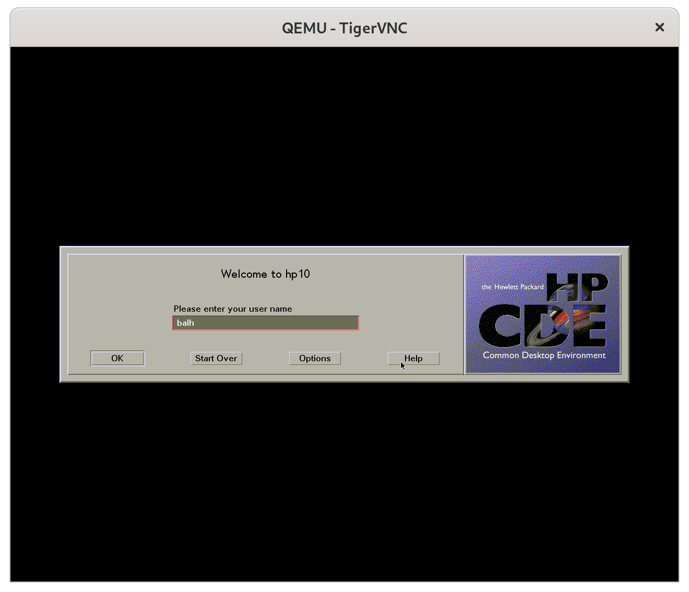
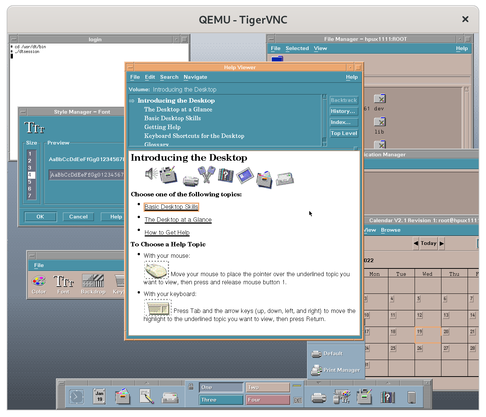

====
Qemu
====

.. _qemu_for_pa_risc_overview:

QEMU for PA-RISC overview
-------------------------

.. important::

   - Please run at least QEMU version 8.0.0
   - 64-bit CPU emulation requires at least QEMU version 8.2.
   - Idealy use stable QEMU versions v9.1.1, v9.0.3, v8.2.7 or v7.2.14
   - Qemu v9.1.0 misses two patches to correctly emulate 64-bit CPUs:
     `one patch for system-mode <https://gitlab.com/qemu-project/qemu/-/commit/ead5078cf1a5f11d16e3e8462154c859620bcc7e>`__
     and `one patch for user-mode <https://gitlab.com/qemu-project/qemu/-/commit/d33d3adb573794903380e03e767e06470514cefe>`__.

QEMU can emulate two different machines:

- a 32-bit `HP B160L desktop <https://www.openpa.net/systems/hp-visualize_b132l_b160l_b180l.html>`__
  with up to 16 concurrent PA7100LC CPUs (SMP), and
- a 64-bit `HP C3700 workstation <https://www.openpa.net/systems/hp-visualize_b1000_c3000_c3600.html>`__
  with up to 16 concurrent PA8700 CPUs (SMP).

Use the QEMU *-machine B160L* (for a 32-bit machine) or *-machine C3700*
(for a 64-bit machine) option to boot. Various operating systems are
supported, e.g. Linux, HP-UX and BSD variants. For details please check
the sections below. PA-RISC machines need a firmware ("PDC" = Processor
Dependend Code), and QEMU comes with a precompiled firmware which is
based on a `fork of SeaBIOS <https://github.com/hdeller/seabios-hppa/>`__.

QEMU for PA-RISC has been developed by:

- `Richard Henderson <mailto:rth@twiddle.net>`__: QEMU CPU emulation, QEMU hardware drivers
- `Helge Deller <mailto:deller@gmx.de>`__: QEMU hardware drivers, SeaBIOS PDC firmware, CPU emulation bug fixes, QEMU linux-user
- `Sven Schnelle <mailto:svens@stackframe.org>`__: Lots of fixes in QEMU and SeaBIOS (SCSI, CPU emulation fixes, SeaBIOS PDC firmware)

QEMU for PA-RISC can be further developed via paid contract from:

- `Mark Cave-Ayland <mailto:mark.cave-ayland@ilande.co.uk>`__: offers paid contract work on QEMU for PA-RISC

.. _qemu_supported_guest_operating_systems:

QEMU supported guest operating systems
--------------------------------------

QEMU does support those operating systems as guests:

- Linux (Debian, Gentoo)
- `HP-UX <https://en.wikipedia.org/wiki/HP-UX>`__, versions 9.x up to 11.11
- `NetBSD <https://wiki.netbsd.org/ports/hppa/>`__, >= 8.0
- `NextSTEP <https://winworldpc.com/product/nextstep/3x>`__
- `OSF/MkLinux <ftp://ftp.cirr.com/pub/hppa/mklinux/>`__

.. _qemu_command_line_options:

QEMU command line options
-------------------------

``-machine C3700``
  start a 64-bit C3700 workstation (qemu >= v8.2)

``-machine B160L``
  start a 32-bit B160L workstation (default)

``-smp cpus=4``
  define number of CPUs in the guest (maximum CPUs: 32)

``-m 1G``
  tell machine to have 1G of RAM memory

``-accel tcg,thread=multi``
  always use this to enable parallel tcg (otherwise all guest CPUs run on one host CPU)

``-boot menu=on``
  Firmware: enable interactive mode (same as "BOOT PRI **IPL**")

``-boot order=c``
  Firmware: Boot from first hard disc

``-boot order=d``
  Firmware: Boot from first CD/DVD

``-boot order=g-m``
  Firmware: Boot from SCSI ID0 ("g"), SCSI ID1 ("h"), ... SCSI ID7 ("m")

``-serial mon:stdio``
  multiplex serial console to stdout (you want to enable this option!)

``-nographic``
  disable artist graphic card emulation, so no graphics output

``-display sdl``
  if you need graphics you should prefer SDL display output if your run
  Qemu < v2.0. In previous qemu versions, GTK had a bug which slows down
  output.

``-vnc :1``
  start graphics output on VNC output, connect to *hostname*:1 with any VNC viewer

``--nodefaults``
  create an empty machine without default SCSI or network controller
  (qemu >= v8.2). Add "-serial mon:stdio" to get a serial console,
  otherwise no output will be visible.

HPPA specific qemu options
~~~~~~~~~~~~~~~~~~~~~~~~~~

``-global artist.width=800 -global artist.height=600``
  set Artist graphic card to 800x600 pixels

``-fw_cfg opt/pdc_debug,string=255``
  enable all firmware debug infos (1: show PDC calls, 2: show IODC calls)

``-fw_cfg opt/hostid,string=334455``
  set the hostid to *334455* (instead of the default value
  *2006243326*). Visible in Linux in /proc/cpuinfo, and with "uname -i"
  in HP/UX

``-fw_cfg opt/console,string=[serial or graphics]``
  set default firmware output method to serial or graphics console. When
  selecting serial, you need to add e.g. "``-serial mon:stdio``" too.

``-fw_cfg opt/font,string=[1-4]``
  select default graphics font: HP 8x16 (#1), HP 6x13 (#2), HP 10x20
  (#3) or Linux 16x32 (#4)

``-fw_cfg opt/power-button-enable,string=0``
  disable power button support (from SeaBIOS v14, Qemu v8.2)

``-fw_cfg opt/OS64,string=3``
  Bitmask to define the PDC_MODEL_CAPABILITIES on a 64-bit machine:
  1=Allow 64-bit OS, 2=Allow 32-bit OS, 3=Allow 32- and 64-bit OS
  (default), available with SeaBIOS >= v16

While running you can press
~~~~~~~~~~~~~~~~~~~~~~~~~~~

``ctrl-A + X``
    to exit qemu.

``ctrl-A + C + ENTER``
    Start Qemu monitor. When started with "-serial mon:stdio", the serial
    port and the QEMU debug port are multiplexed and you can switch
    between them with this key combination.

``ctrl-Alt + F``
    switch to fullscreen when using SDL output

type ``NMI`` in qemu monitor (``ctrl-A + C``)
    to trigger HPPA TOC (transfer-of-control = Reset) button switch

``ctrl-A + H``
    to display help for all the available key bindings.

``ctrl-A + S``
    to save the VM state to a file.

``ctrl-A + L``
    to load the VM state from a file.

``ctrl-A + R``
    to reset the VM.

``ctrl-A + P``
    to pause the VM.

``ctrl-A + U``
    to unpause the VM.

.. _examples_on_how_to_start_the_emulator:

Examples on how to start the emulator
-------------------------------------

Here are some examples of how to start the QEMU emulator for PA-RISC:

1. Start QEMU with a snapshot and multiple SCSI devices::

    qemu-system-hppa -snapshot -m 512 -device lsi,id=scsi0 \
       -device scsi-hd,drive=drive0,bus=scsi0.0,channel=0,scsi-id=5,lun=0,bootindex=2 \
       -drive file=hdd5.img,if=none,id=drive0 \
       -device scsi-hd,drive=drive1,bus=scsi0.0,channel=0,scsi-id=6,lun=0,bootindex=1 \
       -drive file=hdd2.img,if=none,id=drive1 \
       -accel tcg,thread=multi -serial mon:stdio

2. Start QEMU with a specific hard drive image and enable graphical boot menu::

    qemu-system-hppa -drive file=hdd.img -nographic -serial mon:stdio \
       -accel tcg,thread=multi -smp cpus=2 -drive file=hdd2.img \
       -boot menu=on -boot order=h

3. Start QEMU with a CD-ROM image and network configuration::

    qemu-system-hppa -boot d -m 512 -drive file=disk.img,format=qcow2 \
       -netdev tap,id=nic1,script=/etc/qemu-ifup -cdrom /opt/iso/HPUX_10.20.iso \
       -device tulip,netdev=nic1,mac=01:00:11:00:00:02 \
       -serial telnet:0.0.0.0:8001,server,nowait -monitor stdio -nographic

4. Start QEMU with a kernel image and bridge networking::

    qemu-system-hppa -drive file=../qemu-images/hdd.img -kernel vmlinux \
       -append "root=/dev/sda5 cryptomgr.notests panic=-1" -serial mon:stdio \
       -nographic -accel tcg,thread=multi -smp cpus=3 \
       -netdev bridge,id=hn0,br=virbr0,helper=./qemu-bridge-helper \
       -device tulip,netdev=hn0,id=nic1

.. _qemu_special_emulated_assembler_statements:

QEMU special emulated assembler statements
------------------------------------------

The emulated guest may use specific asssembler statements to control the
qemu emulator:

``.word 0xfffdead0``
  immediately halt the emulator, similiar to turning the machine off

``.word 0xfffdead1``
  reset machine

``.word 0xfffdead2``
  restore original (pre-interrupt) values back into shadow registers,
  used by SeaBIOS when executing NMI instruction in qemu

``or %r10,%r10,%r10``
  idle loop; wait for interrupt

``or %r31,%r31,%r31``
  death loop; offline cpu (currently implemented for idle loop).

Qemu standard debugging options
~~~~~~~~~~~~~~~~~~~~~~~~~~~~~~~

``-d item[,...]`` (env var: ``QEMU_LOG`` e.g in_asm,out_asm)
  enable logging of specified items (use '-d help' for a list of items)

``dfilter 0..0xfffff`` (env var: ``QEMU_DFILTER``)
  filter logging based on given address range

How to build QEMU from source
-----------------------------

First clone the QEMU git tree::

  git clone https://gitlab.com/qemu-project/qemu.git

Then change to the QEMU source directory::

  cd qemu

Check out the `qemu git tree <https://gitlab.com/qemu-project/qemu>`__

.. note::

  If you plan to run the qemu-user static binary on Debian-11 or below,
  you NEED to apply this patch: https://github.com/hdeller/qemu-hppa/commit/540e8fb618e66b4c172cc528c12580bb09e301b6
  (linux-user: handle binfmt-misc P flag as a separate exe name)

Run configure, e.g.

for system emulation without networking::

  ./configure --target-list=hppa-softmmu --enable-numa

for system emulation::

  ./configure --target-list=hppa-softmmu --enable-numa --enable-slirp

for user emulation::

   ./configure --target-list=hppa-linux-user --disable-stack-protector \
     --prefix=/home/qemu-hppa/chroot-unstable \
     --interp-prefix=/home/qemu-hppa/chroot-unstable --enable-slirp --stable

for user emulation without networking::

   ./configure --target-list=hppa-linux-user --disable-stack-protector \
     --prefix=/home/qemu-hppa/chroot-unstable \
     --interp-prefix=/home/qemu-hppa/chroot-unstable --stable

.. note::
   **Issues with Capstone package**
   
   If you encounter issues with the Capstone package during compilation, you may need to build it from source:
   
   1. Download Capstone from GitHub: https://github.com/capstone-engine/capstone
   
   2. Build with position independent code:
   
      .. code-block:: bash
         
         mkdir build && cd build
         cmake -DCMAKE_POSITION_INDEPENDENT_CODE=ON ..
         make
         sudo make install
   
   3. You might see some warnings during compilation after this, but they can be safely ignored.
   
   4. Continue with QEMU compilation as normal.

Run the following commands to build and install QEMU:

.. code-block:: bash

  make

or::

  make install  # This will install the built QEMU binaries to the specified prefix directory

Linux
-----

- Linux kernel >= 4.14 runs best, with initial optimizations added for
  kernels >= 4.9.

- Prefer the Tulip NIC, then e1000 over the rtl8129 card. The latter
  gives irq issues with Dino emulation.

- If you try to boot older Linux install CDs (Debian-5, Debian-8,
  Debian-9), you may need to start qemu with ``-boot menu=on``, and then
  change the kernel console option to ``console=ttyS0`` (serial port)
  instead of "console=tty0" (terminal). Then switch in GUI to the
  "serial0" device to see console. Alternatively start without graphical
  console, e.g. with ``-nographic``

Ready-to-run Debian Linux QEMU images for parisc
~~~~~~~~~~~~~~~~~~~~~~~~~~~~~~~~~~~~~~~~~~~~~~~~

Download Debian-12 hard disc image::

    wget http://dellerweb.de/qemu/debian-12-hdd-2023.img.bz2  # Debian 12 image

Unzip Image::

    bunzip2 debian-12-hdd-2023.img.bz2  # Unzip Debian 12 image

Download Debian-10 hard disc image::

    wget http://dellerweb.de/qemu/debian-10-hdd.img.bz2  # Debian 10 image

Unzip image::

    bunzip2 debian-10-hdd.img.bz2  # Unzip Debian 10 image

Run qemu:

Networking variant - with user-mode networking::

    qemu-system-hppa -drive file=debian-12-hdd-2023.img -nographic \
      -serial mon:stdio -accel tcg,thread=multi -smp cpus=4 \
      -netdev user,id=net0 -device tulip,netdev=net0

Non-networking variant::

    qemu-system-hppa -drive file=debian-12-hdd-2023.img -nographic \
      -serial mon:stdio -accel tcg,thread=multi -smp cpus=4

.. note::
  | Credentials: 
  | **Log-in:** root
  | **Password:** rootme

If a key is missing while running apt-update, do::

  apt-key adv --keyserver keyserver.ubuntu.com --recv-keys <KEY_ID>

Replace <KEY_ID> with the actual key ID shown in the error message.
For example, if you see an error about key '1234ABCD', run::

  apt-key adv --keyserver keyserver.ubuntu.com --recv-keys 1234ABCD

Note: In newer Debian versions, apt-key is deprecated, but this approach 
still works for the Debian images provided above.

If you get any error such as **'gnupg, gnupg2 and gnupg1 do not seem to be installed, but one of them is required for this operation'** be sure to run these commands::

Download the ASCII-armored key::
    
    wget https://ftp-master.debian.org/keys/archive-key-12.asc -O /etc/apt/trusted.gpg.d/debian-ports.asc
  
Download a pre-converted .gpg version of the same key (already dearmored)::
    
    wget https://people.debian.org/~gio/archive-key-12.gpg -O /etc/apt/trusted.gpg.d/debian-ports.gpg
  
Then run as usual::
    
    apt update

How to run QEMU with Debian-10 installer image
~~~~~~~~~~~~~~~~~~~~~~~~~~~~~~~~~~~~~~~~~~~~~~

- Create a virtual hard disc once::

    qemu-img create -f qcow2 hdd.img 50G

- download a Linux install image, e.g.

  - for debian: http://backup.parisc-linux.org/debian-cd/debian-11.0.0-hppa-NETINST-1.iso
  - for gentoo: http://distfiles.gentoo.org/releases/hppa/autobuilds/

- Start emulator with the installer image once::

    qemu-system-hppa -drive file=hdd.img \
        -drive file=debian-11.0.0-hppa-NETINST-1.iso,media=cdrom \
        -boot order=d -accel tcg,thread=multi -smp cpus=4 \
        -serial mon:stdio -nographic

- Choose typical installation options, the defaults are OK.
- Shut down virtual machine after installation
- Start emulator with installed operating system any time::

    qemu-system-hppa -drive file=hdd.img -nographic \
        -serial mon:stdio -accel tcg,thread=multi -smp cpus=4

How to create chroot for linux-user
~~~~~~~~~~~~~~~~~~~~~~~~~~~~~~~~~~~

Examples for debian::

    a=armhf && debootstrap --arch=$a --include=busybox,gcc,gnupg --keyring=/usr/share/keyrings/debian-archive-keyring.gpg --foreign sid $a-chroot http://deb.debian.org/
    debootstrap --arch=ppc64el --include=busybox --foreign sid ppc64el-chroot
    debootstrap --arch=alpha --include=busybox --keyring=/usr/share/keyrings/debian-ports-archive-keyring.gpg --foreign sid alpha-chroot http://ftp.ports.debian.org/debian-ports/
    a=powerpc && debootstrap --arch=$a --include=busybox --keyring=/usr/share/keyrings/debian-ports-archive-keyring.gpg --foreign sid $a-chroot http://ftp.ports.debian.org/debian-ports/
    cp /etc/passwd, group, shells target/etc
    echo armhf-chroot > etc/debian_chroot

Gentoo Linux
~~~~~~~~~~~~

- From https://www.gentoo.org/downloads/#hppa download the Minimal
  installation CD or the hppa32 netboot image (lif file)
- Start qemu with "-cdrom ", or the lif file with "-drive file=", e.g.::

    qemu-system-hppa -drive file=gentoo-2020-hppa-netboot.lif \
        -accel tcg,thread=multi -smp cpus=2 -nographic

HP-UX
-----

- You will need a set of HP-UX PA-RISC installation CD-ROMS or DVDs

  - as of 2024 only booting 32-bit HP-UX is working. We are working on adding 64-bit support.
  - starting from `HP-UX 10.x up to 11.11 (11i v1) <https://www.openpa.net/hp-ux_unix.html#hpux11i>`__
  - only PA-RISC installation medias are supported. CDs for Itanium-2 based HP machines are NOT supported.
  - you may copy those CDs to ISO files for usage with qemu.
  - please support us by buying from `our sponsors <https://parisc.wiki.kernel.org/index.php/Main_Page#Our_sponsors>`__.

- **NOTE**: Please **keep the default screen resolution of 1280x1024
  pixels**. HP-UX may crash if you increase the width, or in graphical
  environment (with dtwm) the mouse won't be able to reach any line >=
  1146 pxels.

- You probably won't be able to boot an original HP-UX installed hard
  disc image coming from a physical machine other than a B160L. The
  reason is, that the HP-UX kernel from the other machine has drivers
  built-in and won't recognize the SCSI and network in the emulated
  virtual machine.

- LASI NIC emulation and NCR 710 emulation is needed in order to be able
  to boot older HP-UX releases.

- Even physical HP machines were not able to boot every HP-UX 11 minor
  version. The HP support matrix at http://hpe.com/info/hpuxservermatrix
  gives you an overview.

- `Astrobaby wrote about his test results.  <https://astr0baby.wordpress.com/2019/04/28/running-hp-ux-11-11-on-qemu-system-hp>`__

- Hints:

  - The "INTERRUPT KEY" mentioned sometimes by HP-UX can be emulated
    with the ``Ctrl-\\`` or ``Ctrl-#`` key combination

  - In case you lost the HP-UX root password, boot at ISL ``hpux -is``
    and then give a new password with running "passwd" (you need to use
    the ``-boot menu=on`` qemu option)

  - When booting HP-UX may show strange characters instead of brackets -
    just delete the file /etc/kbdlang, reboot and choose PS2_DIN_US language

- How to start X11, CDE or dtwm

  - CDE Login: init 4
  - CDE desktop: start "xinit", then "/usr/dt/bin/dtsession"
  - X11: startx
  - dtwm Window Manager: start "xinit", then run "/usr/dt/bin/dtwm".

- How to run full filesystem check: ``fsck -F vxfs -y -o full``
- File downloads see https://archive.org/download/hpunix/

HP-UX 10.20
~~~~~~~~~~

For HP-UX 10.20, you can find images at `archive.org <https://archive.org/details/hpux_20200510>`__. 
The link contains both img and iso files for HP-UX 10.20.

To run the image use the command(keep in mind this will run HPUX 10.20 with networking turned on)::

    qemu-system-hppa -accel tcg,thread=multi -m 512 -drive if=scsi,bus=0,index=6,file=OS_test/hpux.img,format=raw -net nic,model=tulip -net user -boot c -serial mon:stdio -nographic

.. note::
   | Credentials: 
   | **Log-in:** root
   | **Password:** p4ssw0rd

Note that the credentials provided at the archive.org link might not be valid.

HP-UX 9 is the first HP-UX release which does support the PA-RISC CPU.
HP-UX 9.05 fails when booting the install CD (reported 2021/05/18)::

    Stored message buffer up to panic:
        Floating point coprocessor configured and enabled.
        No BTLB entries found for processor 0
        Unsupported module type 0x7 found
        System Panic:
            B2352A HP-UX (A.09.05) #2: Tue Oct 18 15:46:14 PDT 1994
        panic: (display==0xbc00, flags==0x0) Unable to initialize msus structure
        PC-Offset Stack Trace (read across, most recent is 1st):
            0x000ec6f8  0x000d7e3c  0x00081e5c  0x000254c0
        End Of Stack
        dumping 0 bytes to dev 0xffffffff, offset 0 ...
        Dump failed, returning 5.

according to `this document <https://archive.org/stream/bitsavers_hp9000hpuxingHPBASICUX6.2Aug91_5917615/E2040-90001_Using_HP_BASIC_UX_6.2_Aug91_djvu.txt>`__
"msus" means "mass storage unit specifier" and "msvs" means "mass
storage volume specifier" while the msvs is sometimes called an "msus".
I assume HP-UX 9.05 doesn't know how to handle the emulated SCSI PCI
card and thus can't access the disc. Remember, a B160L is different to a
HP700, and a HP700 had a built-in LASI700 (NCR700) SCSI controller.

HP ODE
~~~~~~

The HP :doc:`Offline Diagnostic Environment (ODE)
<offline_diagnostic_environment_ode>` is a great utility to test the
quality of the QEMU emulation. This is an ongoing effort, see above
website for details.

HP-UX 9.x
~~~~~~~~~

This does not work yet. Mostly due to missing qemu drivers. For here for
some notes about how to install :doc:`HPUX-9 <hpux-9>`.

NetBSD
------

Relevant NetBSD/hppa links:

- Daily install images: https://nycdn.netbsd.org/pub/NetBSD-daily/netbsd-9/latest/images/
- Install images: https://cdn.netbsd.org/pub/NetBSD/install-images/
- Generic NetBSD/hppa info: http://wiki.netbsd.org/ports/hppa/
- How to install NetBSD with qemu: http://wiki.netbsd.org/ports/hppa/qemu_hppa/

Please note that at least NetBSD-8 required. NetBSD-7 doesn't work,
since the NetBSD kernel trap handler code complains about the stack
pointer in the trap frame. Reported error is::

    insanity: 'tf->tf_sp >= minsp && tf->tf_sp < maxsp' at trap:556 type 0xf tf 0xe00040 lwp 0xe38140 sp 0xa0 pc 0x200240

(info by Nick Hudson <nick.hudson@gmx.co.uk>)

OSF/MkLinux
-----------

Download at ftp://ftp.cirr.com/pub/hppa/mklinux/ The file
root_ext2_g.dd.bin.gz doesn't cleanly decompress.. so I did a gzip -dc
into root_ext2_g.dd.bin.

MkLinux sources: https://github.com/slp/osfmk-mklinux

::

    qemu-system-hppa -boot c -drive if=scsi,bus=0,index=3,file=root_ext2_g.dd.bin,format=raw \
        -serial mon:stdio -nographic -m 128

It boots, but fails during device detection because Qemu currently
emulates a B160, while MkLinux expects a HP700. So it fails to see the
LASI chip below the GSC bridge::

    NVM bootdata Bad Checksum (0)
    OSF Mach boot
    : /mach
    text (0x95618) at 0x11000
    data (0x48594) at 0xa8000
    Mach 3.0 VERSION(PMK1.1): cb \ \ ; Wed Nov 26 17:20:37 MET 1997; mach_kernel/PRODUCTION (cameleon)
    HP9000/
    unknown machine type 0x502
    good luck :-)
    , 0K Icache, 0K Dcache, 256 entry shared TLB)
    Warning: unsupported module at ffc00000 (type:7 svers:0 hvers:50)
    Stack Trace (depth=1):
         0x00084d68
    End of Stack 

(info by Jason Stevens <neozeed@gmail.com>)

Future QEMU work
----------------

Possible enhancements:

- Add Dino/Lasi serial port
- Harmony sound card in Lasi
- Does HP-UX has some kind of "sleep" assembler instruction in it's idle loop which can be used to lower qemu power consumption?
- Fix virtio-drivers in SeaBIOS (missing endianess conversions, because SeaBIOS is originally only Little-endian for x86)
- Emulate a 712 and/or j5000 machine
- Emulate built-in LASI SCSI controller instead of PCI SCSI add-on card

Screenshots
-----------

HP-UX CDE graphical Login
~~~~~~~~~~~~~~~~~~~~~~~~~

HP-UX CDE
~~~~~~~~~

HP-UX 10.20 with VUE
~~~~~~~~~~~~~~~~~~~~

.. image:: media/hpux-10-vue.png
